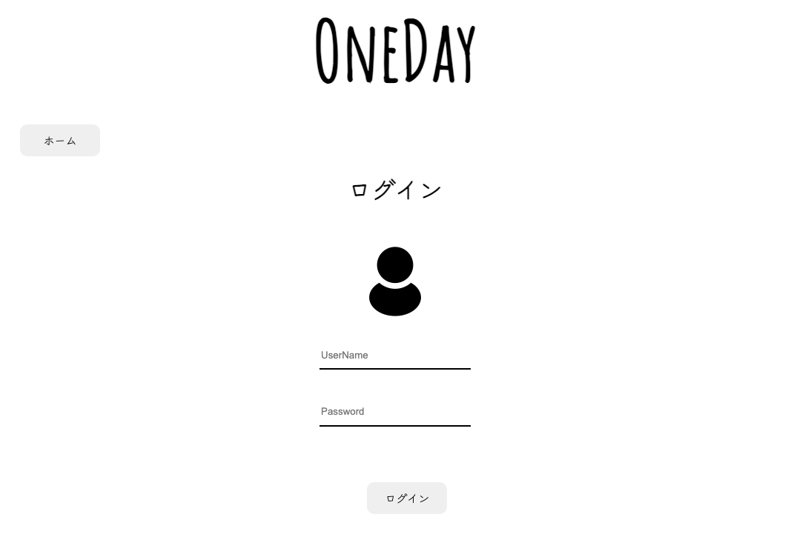
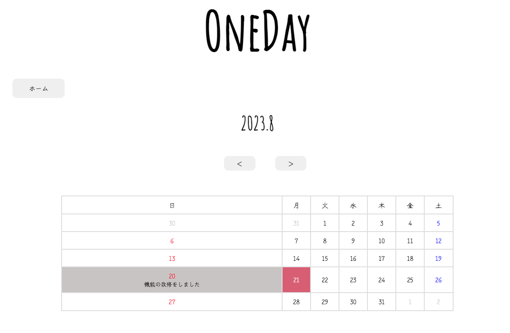

# アプリ名：OneDay

## 概要

日常に起こったことを記録していくアプリです。 

## 目指した課題解決
些細な嬉しかった、良かったことを記録していくことで、前向きな気持ちになれる手助けになればいいなと思い開発しました。

## 利用方法

新規登録を行い、利用を開始してもらいます。
カレンダーをタップしたら、投稿の確認ができるようになっっています。 
吹き出しをタップしたら、投稿できるようになっています。

## 実装予定の機能
トップページの画像をモノクロで採用し、投稿されるたびにトップページのモノクロ画像に色がついていく機能を実装予定です。

## 使用技術

* HTML5
* CSS3
* JavaScript
* PHP
* MySQL
* Apache

## 機能一覧

* 新規登録
* ログイン
* 投稿
* 投稿確認

