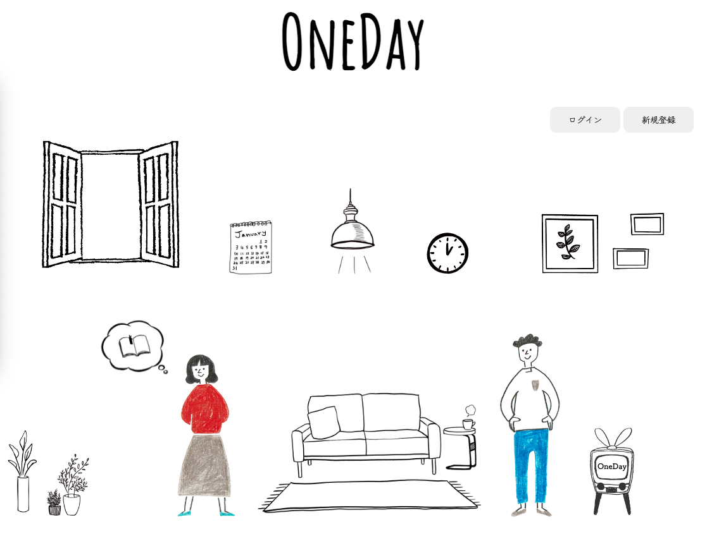

# アプリ名：OneDay


## 概要

日常に起こったことを記録していくアプリです。<br>

## 目指した課題解決
些細な嬉しかった、良かったことを記録していくことで、前向きな気持ちになれる手助けになればいいなと思い開発しました。

## 利用方法

新規登録を行い、利用を開始してもらいます。<br>
カレンダーをタップしたら、投稿の確認ができるようになっています。<br>
吹き出しをタップしたら、投稿できるようになっています。

## 実装予定の機能
・トップページの画像をモノクロで採用し、投稿されるたびにトップページのモノクロ画像に色がついていく機能を実装予定です。<br>
・新規登録の際、同じメールアドレスの拒否

## 環境構築

今回は初学者に扱い易くデータベースを視覚的に管理しやすい為、MAMPを採用しました。

### 1. MAMPのダウンロード：

MAMPの公式ウェブサイト（https://www.mamp.info/）からMAMPをダウンロード。無料版と有料版がありますが、基本的な開発には無料版で十分。

### 2. MAMPの設定：
MAMPアプリケーションを起動したら、以下の設定を行います。

Apacheポート：デフォルトではポート番号が8888ですが、変更したい場合はポート番号を変更します。<br>
MySQLポート：デフォルトではポート番号が8889ですが、変更したい場合はポート番号を変更します。<br>
ウェブサーバーのルートディレクトリ：ウェブサイトのファイルを配置するルートディレクトリを指定します。デフォルトでは/Applications/MAMP/htdocsになっています。

### 3. MAMPの起動：
MAMPアプリケーションでApacheとMySQLを起動します。起動ボタンをクリックして、サーバーが起動することを確認します。

### 4. ウェブサイトの作成：
ウェブサイトのファイルをウェブサーバーのルートディレクトリに配置します。<br>
デフォルトのルートディレクトリは/Applications/MAMP/htdocsです。ここにHTMLファイルやPHPファイルを配置すると、ウェブサーバー経由でアクセスできるようになります。

### 5. ウェブサイトのアクセス：
ウェブブラウザで http://localhost:ポート番号 （ポート番号はデフォルトで8888です）にアクセスします。MAMPが起動していれば、ウェブサイトが表示されるはずです。

## セットアップ

### データベース

db作成
```SQL
CREATE DATABASE oneday;
```

テーブル:「diary」作成	
```SQL
    CREATE TABLE diary (
        id INT PRIMARY KEY,
        name VARCHAR(255),
        text TEXT,
        created TIMESTAMP
    );
```

テーブル:「members」作成	
```SQL
    CREATE TABLE members (
        id INT PRIMARY KEY,
        name VARCHAR(255),
        password VARCHAR(255),
        email VARCHAR(255),
        created TIMESTAMP
    );
```

## 使用技術

* HTML5
* CSS3
* JavaScript
* PHP
* MAMP(MySQL,Apache)


## 機能一覧

* 新規登録
* ログイン
* 投稿
* 投稿確認


